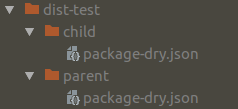

## DRY - Use npm across multiple projects without repeating yourself

### Get it

```bash
npm i -g dry-dry
```

### Use it
```bash
dry init
```

### The copy/paste madness

Because companies and other groups have bunch of `package.json` attributes that are the same across all npm projects.
Those attributes must be maintained using copy/past across all projects. 
This is wrong !

We believe that those attributes should be easily distributed and updated across projects.

### Do not repeat yourself

`dry` is a stupid `npm` wrapper allowing any `package.json` to extend a parent file.
The parent file can be located on the system or simply inside a published npm module.

### How does it work

On each `dry` command, `dry`:
- creates a merged `package.json` based on the provided `package-dry.json`
- runs the `npm` command
- applies the possible `package.json` modifications made by `npm` to `package-dry.json`
- removes `package.json`

`package.json` is always removed to make sure that nobody will execute a pure `npm` command in a `dry` project.

### Inheritance in action



##### Parent project

package-dry.json
```json
{
  "name": "parent",
  "version": "1.0.0",
  "description": "",
  "main": "index.js",
  "scripts": {
    "test": "echo \"Error: no test specified\" && exit 1",
    "foo": "npm help"
  },
  "keywords": [],
  "author": "",
  "license": "ISC"
}
```

##### Child project

package-dry.json
```json
{
  "name": "child",
  "version": "1.0.0",
  "description": "",
  "main": "index.js",
  "scripts": {
    "test": "echo \"Error: no test specified\" && exit 1"
  },
  "keywords": [],
  "author": "",
  "license": "ISC",
  "dry": {
    "extends": "parent/package-dry.json",
    "dependencies": {
      "parent": "1.0.0"
    }
  }
}
```

### package-dry.json

To do that, `dry` introduces a file named `package-dry.json`.
`package-dry.json` replaces `package.json` in your dry projects.
Of course, it can contain all the attributes of `package.json` with the addition of an attribute called `dry`.

package-dry.json `dry` attribute has 2 optional attributes:
- `extends` - The parent of the current dry package
- `dependencies` - The dependencies needed to resolve the file pointed by `extends`. Those dependencies will not be saved to your project.

### dry commands

`dry` proxies all received arguments to `npm`.
Just take your usual npm commands and replace the word `npm` with `dry`.

npm | dry
---------|-------------
npm init | dry init
npm i | dry i
npm install | dry install
npm publish | dry publish
npm x y z | dry x y z
